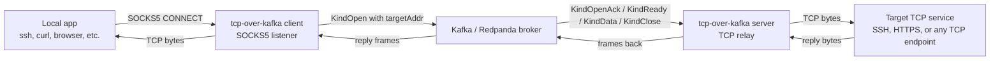
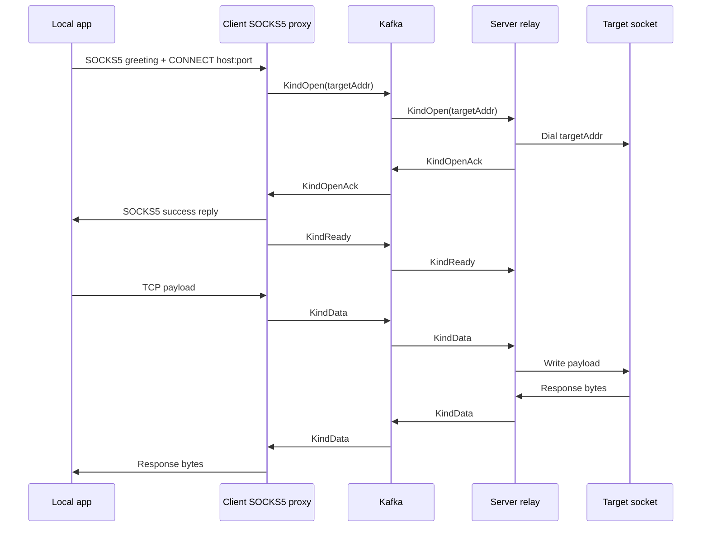
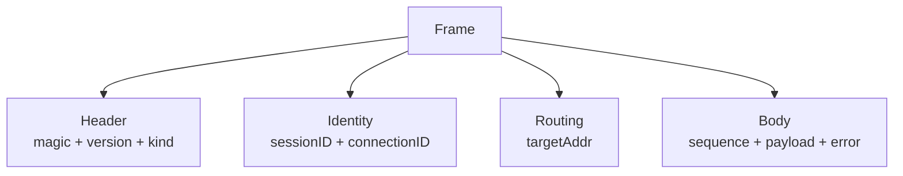

# tcp-over-kafka

## Design Overview

`tcp-over-kafka` is a proof-of-concept TCP proxy that carries raw byte streams over Kafka. The client side now speaks SOCKS5, so one local service can forward SSH, HTTPS, and other TCP traffic through the tunnel.

The design is intentionally simple:

- one client-side SOCKS5 listener accepts local proxy requests
- one server-side relay dials the requested destination
- Kafka carries framed byte payloads between the two services
- the transport is TCP stream forwarding, not packet forwarding



## How It Works

Each SOCKS5 CONNECT request becomes one tunnel session:

1. The client accepts the SOCKS5 greeting and CONNECT request.
2. The client extracts the requested `host:port` destination.
3. The client sends a `KindOpen` frame that includes the requested target address.
4. The server consumes that frame, dials the target socket, and replies with `KindOpenAck`.
5. The client sends the SOCKS5 success reply to the local app, then sends `KindReady`.
6. The server starts relaying target-to-client bytes after `KindReady`.
7. Client-to-server bytes travel as `KindData` frames.
8. Either side can send `KindClose` or `KindError` to terminate the session.



## Internal Structure

- [`cmd/tcp-over-kafka/main.go`](/opt/codes/poc/tcp-over-kafka/cmd/tcp-over-kafka/main.go) selects `client` or `server` mode.
- [`internal/socks5/socks5.go`](/opt/codes/poc/tcp-over-kafka/internal/socks5/socks5.go) handles SOCKS5 greeting, CONNECT parsing, and replies.
- [`internal/frame/frame.go`](/opt/codes/poc/tcp-over-kafka/internal/frame/frame.go) defines the binary frame format.
- [`internal/tunnel/bus.go`](/opt/codes/poc/tcp-over-kafka/internal/tunnel/bus.go) wraps Kafka read/write operations.
- [`internal/tunnel/client.go`](/opt/codes/poc/tcp-over-kafka/internal/tunnel/client.go) accepts SOCKS5 connections and forwards them into Kafka.
- [`internal/tunnel/server.go`](/opt/codes/poc/tcp-over-kafka/internal/tunnel/server.go) consumes frames and relays them to the requested target socket.

### Frame Format

Frames are binary and self-describing:

- magic string and version
- frame kind
- session ID
- connection ID
- target address
- sequence number
- payload bytes
- error string

The `KindOpen` frame carries the requested destination in `targetAddr`. The client then sends `KindReady` after the SOCKS5 success reply, which tells the server it may begin relaying target-to-client bytes.



## Deployment Topology

- Broker: `<broker-host>:9092`
- Client SOCKS5 listener: `<client-host>:1234`
- Server relay: `<relay-host>`

The relay side dials the destination requested by the SOCKS5 client. Replace the placeholders with your environment values when deploying.

## Build and Test

```bash
CGO_ENABLED=0 go test ./...
CGO_ENABLED=0 go build -trimpath -ldflags='-s -w' -o tcp-over-kafka ./cmd/tcp-over-kafka
```

## Run

The deployed systemd units expect the binary at `/usr/local/bin/tcp-over-kafka`.

Client on `<client-host>`:

```bash
systemctl daemon-reload
systemctl enable --now tcp-over-kafka-client
systemctl status tcp-over-kafka-client
```

Server on `<relay-host>`:

```bash
systemctl daemon-reload
systemctl enable --now tcp-over-kafka-server
systemctl status tcp-over-kafka-server
```

## Verify

Use the SOCKS5 listener as the single test surface for both SSH and HTTPS.

SSH proof from `<client-host>`:

```bash
ssh -o ProxyCommand='/usr/local/bin/tcp-over-kafka proxy --socks 127.0.0.1:1234 %h %p' root@<ssh-target> hostname
```

Use the built-in `proxy` subcommand for SSH verification. It is part of the same `tcp-over-kafka` binary and bridges OpenSSH to the local SOCKS5 listener without any extra script.

HTTPS proof from `<client-host>`:

```bash
curl --socks5-hostname 127.0.0.1:1234 https://<https-target>/
```

Use the bare host form only when `<https-target>` is actually serving HTTPS on port `443`. For any other port, include it explicitly in the URL, for example `https://<https-target>:8443/`.

For a local demo, run a temporary TLS listener on the relay host and point the SOCKS5 proxy at it. The same proxy port can carry SSH and HTTPS because both are just TCP streams.

## Test Reports

- Concurrency testing: [`docs/concurrency-test-report.md`](/opt/codes/poc/tcp-over-kafka/docs/concurrency-test-report.md)
- File transfer and size-limit testing: [`docs/file-transfer-test-report.md`](/opt/codes/poc/tcp-over-kafka/docs/file-transfer-test-report.md)

## Operational Notes

- Existing proxy services were stopped, not removed.
- The relay supports multiple concurrent SOCKS5 CONNECT sessions, keyed by session ID and connection ID.
- Kafka topics are named `tcp-over-kafka.<tunnel-id>.c2s` and `tcp-over-kafka.<tunnel-id>.s2c`.
- If Kafka is restarted, restart both tunnel services after the broker is reachable again.

## Kafka Relay Risks

Kafka is a usable transport for a TCP relay, but it has tradeoffs compared with a native socket proxy:

- Latency is higher because every byte becomes a Kafka message path.
  - Keep frames small and flush them quickly.
  - Avoid batching that adds visible interactive lag.
- TCP streams must be reconstructed manually.
  - Use explicit `open`, `ready`, `data`, and `close` frames.
  - Never assume one socket read equals one application message.
- Ordering matters.
  - Keep all frames for one connection on the same logical topic/key path.
  - Include `sessionID` and `connectionID` in every frame.
- Broker outages break active sessions.
  - Treat Kafka failure as tunnel failure and reconnect at the tunnel layer.
  - Restart both relay sides after the broker returns.
- Duplicate or replayed frames can happen after restarts.
  - Make `close` and `open` idempotent.
  - Use sequence numbers if stronger deduplication is needed.
- Security must be explicit.
  - Use network isolation and broker authentication in production.
  - Do not assume Kafka is a trusted private channel.

These constraints are why the proxy keeps the relay simple and deterministic rather than trying to emulate a full TCP stack.
