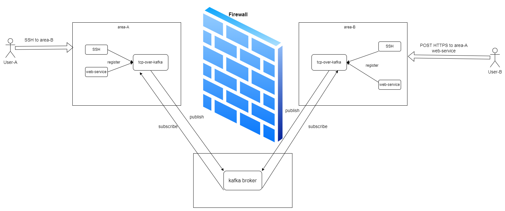

# tcp-over-kafka

`tcp-over-kafka` is a proof-of-concept TCP tunnel that carries bidirectional
TCP sessions over a single Kafka topic. The repository now implements a
symmetric node model:

- every deployed node runs the same `tcp-over-kafka node` runtime
- every node exposes a local SOCKS5 listener for outbound traffic
- every node subscribes to the shared Kafka topic with its own consumer group
- every node can also expose local services addressed by `nid` and
  `eid`

The current deployment and validation flow is intentionally deterministic and
repo-driven. Configuration starts in `./hack/.env.local`, deploy scripts render
one JSON config per node, and the shell E2E suite validates SSH, HTTPS, and
file transfer across the real environment.



For a visual, request-level walkthrough of how one proxied connection moves
through the runtime, open [docs/request-proxy-flow.html](./docs/request-proxy-flow.html).

## Architecture

### Topology

The minimal deployment has three logical roles:

- one Kafka-compatible broker
- node A
- node B

Both nodes run the same binary and the same runtime model. There is no longer a
public split between a dedicated client process and a dedicated server process.

Each node owns:

- one `nid`, usually derived from the node identity such as its IP
  address
- one local SOCKS5 listen address for outbound TCP requests
- one explicit route map from `host:port` to a remote `nid/eid`
- one explicit service map from `eid` to a local `host:port`

### Identity And Addressing

The tunnel routes traffic using two levels of identity:

- `nid`: identifies the remote node
- `eid`: identifies the service exposed on that node

Examples:

- `10.253.15.168 / 22`
- `10.253.15.168 / 443`

In the checked-in deployment defaults, `nid` uses the remote service IP or
domain name and `eid` uses the remote service port string.

Outbound SOCKS traffic always originates from the fixed internal source
`eid` `proxy`. That keeps reply routing deterministic without exposing an
extra operator-facing identifier.

### Routing Model

Each node has two independent maps:

- `routes`
  Maps an outbound `host:port` request to the remote `nid/eid`
  destination that should receive the tunnel session.
- `services`
  Maps an inbound `eid` to a local TCP target on the current node.

Example:

- route `10.253.15.168:22 -> { nid: "10.253.15.168", eid: "22" }`
- service `22 -> 127.0.0.1:22`

This means node A can open a SOCKS session to node B’s SSH service, and node B
can do the same back to node A, using the same runtime and the same wire model.

### Kafka Transport

The transport uses one shared topic for all sessions. Every node consumes the
same topic through a consumer group derived from its own `nid`, so every
node sees every message once and filters on `destinationNID`.

The Kafka message key is the stable conversation key derived from:

- source endpoint
- destination endpoint
- connection ID

That preserves ordering for frames that belong to the same logical TCP
conversation.

### Frame Lifecycle

The wire format is binary and versioned in `./pkg/frame/`. The main frame kinds
used by the runtime are:

- `KindOpen`
  Starts a new logical connection to a remote `nid/eid`.
- `KindOpenAck`
  Confirms the destination service accepted the request.
- `KindReady`
  Signals that the destination side has finished its local dial and is ready to
  exchange payload bytes.
- `KindData`
  Carries raw TCP payload bytes.
- `KindClose`
  Closes the logical conversation.
- `KindError`
  Returns an application-level routing or service failure.

## Implementation

### CLI Surface

The public CLI has two commands:

- `node`
  Runs one symmetric Kafka tunnel node from a JSON config file.
- `proxy`
  Bridges OpenSSH `ProxyCommand` stdio into the local SOCKS5 listener.

Examples:

```bash
./bin/tcp-over-kafka -v
./bin/tcp-over-kafka node --config ./node-a.json
./bin/tcp-over-kafka proxy --socks 127.0.0.1:12345 10.253.15.168 22
```

### Node Configuration

Each node runtime reads one JSON config file. The deploy scripts render that
file from `./hack/.env.local`.

Example:

```json
{
  "broker": "10.253.15.166:9092",
  "topic": "tcp-over-kafka.single-topic.poc",
  "nid": "10.253.15.167",
  "listen": "0.0.0.0:12345",
  "maxFrameSize": 32768,
  "routes": {
    "10.253.15.168:22": {
      "nid": "10.253.15.168",
      "eid": "22"
    },
    "10.253.15.168:443": {
      "nid": "10.253.15.168",
      "eid": "443"
    }
  },
  "services": {
    "22": "127.0.0.1:22",
    "443": "127.0.0.1:443"
  }
}
```

Field meanings:

- `broker`
  Kafka broker address used by the node.
- `topic`
  Shared topic that carries all sessions.
- `nid`
  Unique identity for the current node.
- `listen`
  Local SOCKS5 listener address.
- `maxFrameSize`
  Maximum payload bytes copied into one frame.
- `routes`
  Outbound target map from `host:port` to remote `nid/eid`.
- `services`
  Inbound service map from `eid` to a local TCP target.

### Runtime Flow

The runtime in `./pkg/tunnel/` does four main jobs:

1. Accept SOCKS5 connections on the local listener.
2. Resolve outbound `host:port` requests through the configured route map.
3. Publish and consume frames over Kafka.
4. Dial or accept local service sockets and relay payload bytes in both
   directions.

Implementation details that matter:

- Kafka readers start at `LastOffset` for new deployments.
- Unreadable frames are skipped instead of crashing the reader.
- Consumer groups are derived from `nid`.
- The runtime keeps independent outbound and inbound session registries.
- `KindData` writes now cache the session lookup before dereferencing it, which
  avoids a nil-dereference race during teardown.

### Deployment Implementation

The repository uses `./hack/.env.local` as the repo-local source of truth. That
file controls:

- SSH access to the target hosts
- broker address and broker deployment mode
- node identities, listener addresses, routes, and services
- deployment mode selection per component
- HTTPS helper certificate paths
- E2E payload sizes

The deploy scripts render two kinds of remote artifacts:

- one runtime env file for helper processes such as the broker wrapper and
  HTTPS helper
- one node JSON config per node

For the dual-cluster Kubernetes path, the repo now keeps three independent
deployment contexts:

- the broker stays Docker-managed on `BROKER_SSH_HOST`
- `node-a` uses `NODE_A_KUBECONFIG` and `NODE_A_KUBERNETES_NAMESPACE`
- `node-b` uses `NODE_B_KUBECONFIG` and `NODE_B_KUBERNETES_NAMESPACE`

When both logical nodes use Kubernetes, the deploy scripts require explicit
`NODE_A_KUBECONFIG` and `NODE_B_KUBECONFIG` values. They do not fall back to
the shared default `~/.kube/config`, because that can silently deploy both
logical nodes into the same cluster. If both kubeconfigs intentionally target
the same API server, also pin `NODE_A_K8S_NODE_NAME` and
`NODE_B_K8S_NODE_NAME` to different workers.

Cross-cluster route rendering no longer depends on peer Service DNS names. The
default logical route hosts are:

- `node-a.tcp-over-kafka.internal`
- `node-b.tcp-over-kafka.internal`

Those names are only used inside the tunnel route map. The local Kubernetes
Service DNS names remain in use for in-cluster readiness checks and for each
runner Pod to reach its own local node service.

The broker implementation depends on the broker deploy mode:

- `systemd` uses the Redpanda wrapper from `./hack/run-broker.sh`
- `docker` and `kubernetes` run Kafka in single-node KRaft mode

Supported deployment modes:

| Mode | Command | Notes |
| --- | --- | --- |
| `systemd` | `make deploy-all` or `make deploy-systemd` | Installs units, helper scripts, and rendered configs on the target hosts. The broker path stays on Redpanda. |
| `docker` | `make deploy-docker` | Runs the Kafka broker and node workloads as long-lived Docker containers. |
| `kubernetes` | `make deploy-kubernetes` | Renders manifests with `./hack/render-kubernetes.sh`, applies them with `kubectl`, then runs `kubectl rollout restart` so each deploy forces a fresh Pod rollout even when the manifest is unchanged. The broker manifest uses Kafka in KRaft mode, while node manifests are cluster-native Deployments and Services. |
| `external` | `make deploy-all` with `BROKER_DEPLOY_MODE=external` | Leaves an already-running broker in place and only validates that it is reachable. |

Migration protections are built into the deploy path:

- the systemd node deploy disables legacy `tcp-over-kafka-client` and
  `tcp-over-kafka-server` units
- the docker node deploy removes legacy split-role containers before starting
  the node workload
- the Kubernetes node deploy deletes the old split-role deployments before
  applying the new manifests
- the Kubernetes node deploy no longer depends on SSHing into Kubernetes
  workers or mounting host-local tunnel binaries into Pods

## Quick Start

### Prerequisites

- Go `1.23` or newer
- `jq`
- `ssh` and `scp`
- `sshpass` only if password-based SSH is used
- Docker on target hosts when using Docker deploy mode
- `kubectl` when using Kubernetes deploy mode
- access to the hosts, broker, and HTTPS certificate paths defined in
  `./hack/.env.local`

### Build And Test

```bash
make vendor
make fmt
make vet
make test
make build
./bin/tcp-over-kafka -v
```

The binary is written to `./bin/tcp-over-kafka`.

### Configure The Environment

Edit `./hack/.env.local` to match your target environment. The checked-in file
already documents the expected variables for:

- broker host and deployment mode
- broker images for the systemd Redpanda path and the Docker/Kubernetes Kafka path
- the cluster-pullable tunnel runtime and fixture images used by the Kubernetes node path
- node A and node B SSH hosts, which remain logical node identity defaults and
  legacy non-Kubernetes host inputs
- local kubeconfig copies for node A and node B
- optional node-specific Kubernetes namespaces
- per-node routes and service maps, including the synthetic logical route hosts
- the default deployment convention where `nid` follows the remote IP or domain
  and `eid` follows the remote target port
- HTTPS helper settings
- E2E validation settings

Before running the dual-cluster Kubernetes workflow, prepare the local API
hostname mappings required by the kubeconfigs:

- `10.255.88.236 api-int.ceakedev88232.cesclusterdev232.cn`
- `10.255.69.77 api-int.test6973.ceacube.cn`

Cluster selection for the dual-cluster node path comes from
`NODE_A_KUBECONFIG` and `NODE_B_KUBECONFIG`, not from `NODE_A_SSH_HOST` or
`NODE_B_SSH_HOST`.

### Deploy

```bash
make deploy-all
```

Useful component-level deploy targets:

- `make deploy-broker`
- `make deploy-node-a`
- `make deploy-node-b`

Mixed deployment modes are supported. Example:

```bash
BROKER_DEPLOY_MODE=external \
NODE_A_DEPLOY_MODE=systemd \
NODE_B_DEPLOY_MODE=docker \
make deploy-all
```

Docker validation with the checked-in `apache/kafka:3.9.2` broker image uses:

```bash
BROKER_DEPLOY_MODE=docker \
NODE_A_DEPLOY_MODE=docker \
NODE_B_DEPLOY_MODE=docker \
make deploy-all
```

Remote Docker broker deploys pull the broker image on the local workstation and
copy it to the broker host before `docker load`, so the broker host does not
need direct registry access.

For the mixed path where the broker stays on Docker and both nodes run in
Kubernetes, publish the cluster images first or let `make deploy-all` build and
push them through the deploy script:

```bash
BROKER_DEPLOY_MODE=docker \
NODE_A_DEPLOY_MODE=kubernetes \
NODE_B_DEPLOY_MODE=kubernetes \
make deploy-all
```

The Kubernetes node path expects:

- `KUBERNETES_TUNNEL_RUNTIME_IMAGE` to point at a cluster-pullable image for the
  `tcp-over-kafka` binary, for example
  `image.cestc.cn/ccos-test/tcp-over-kafka:latest`
- `TUNNEL_FIXTURE_IMAGE` to point at the helper image used for the SSH target,
  HTTPS target, and in-cluster E2E runner
- `NODE_A_KUBECONFIG` and `NODE_B_KUBECONFIG` to point at locally prepared
  kubeconfig files for the two clusters
- if the two kubeconfigs target the same cluster intentionally,
  `NODE_A_K8S_NODE_NAME` and `NODE_B_K8S_NODE_NAME` must be set to different
  worker names
- `NODE_A_KUBERNETES_NAMESPACE` and `NODE_B_KUBERNETES_NAMESPACE` to be set
  when the two clusters should not share the same namespace value
- `HELLO_HTTPS_CERT` and `HELLO_HTTPS_KEY` to exist locally so they can be
  rendered into Kubernetes `Secret` objects

## Validation

The shell E2E suite runs against the real environment from `./hack/.env.local`.

```bash
make e2e-test
make e2e-test-ssh
make e2e-test-https
make e2e-test-file
make e2e-test-concurrency
```

For the Docker validation path with `apache/kafka:3.9.2`,
deploy first and then run the suite:

```bash
BROKER_DEPLOY_MODE=docker \
NODE_A_DEPLOY_MODE=docker \
NODE_B_DEPLOY_MODE=docker \
make deploy-all
make e2e-test
```

For the mixed Docker broker plus Kubernetes nodes path, the shell E2E scripts
automatically re-execute inside Kubernetes runner Pods so the SOCKS, SSH, and
HTTPS traffic stays inside the cluster network:

```bash
BROKER_DEPLOY_MODE=docker \
NODE_A_DEPLOY_MODE=kubernetes \
NODE_B_DEPLOY_MODE=kubernetes \
make deploy-all
make e2e-test
make e2e-test-concurrency
```

That validation path now launches one runner Pod in each cluster:

- the runner in node A’s cluster executes only `node-a -> node-b`
- the runner in node B’s cluster executes only `node-b -> node-a`

This keeps local SOCKS access on cluster-local Service DNS while still
exercising the logical cross-cluster route hostnames.

The suite validates:

- SSH through node A to node B and through node B to node A
- HTTPS through both directions
- file transfer integrity in both directions
- the documented SSH and HTTPS concurrency sweeps when using
  `make e2e-test-concurrency`

Validation runbooks:

- [Stability Runbook](./docs/stability-test-report.md)
- [Concurrency Runbook](./docs/concurrency-test-report.md)
- [File Transfer Runbook](./docs/file-transfer-test-report.md)

## Repository Layout

- `./cmd/tcp-over-kafka/`
  Cobra entrypoint and public commands.
- `./pkg/frame/`
  Versioned wire format and frame codec.
- `./pkg/socks5/`
  Minimal SOCKS5 handshake and proxy helpers.
- `./pkg/sshproxy/`
  OpenSSH `ProxyCommand` bridge for the local SOCKS listener.
- `./pkg/tunnel/`
  Symmetric node runtime, routing logic, config loading, Kafka bus, and tests.
- `./deploy/systemd/`
  systemd units for the broker, node runtime, and HTTPS helper.
- `./hack/`
  Environment file, deploy scripts, helper scripts, and E2E test entrypoints.
- `./docs/`
  Architecture asset and validation runbooks.

## Notes

- This project is a deterministic proof of concept, not a production-ready
  generic proxy.
- When the wire format changes, add a new frame version rather than
  overloading the current one.
- The route and service maps are intentionally explicit. There is no dynamic
  service discovery layer in this repository.
